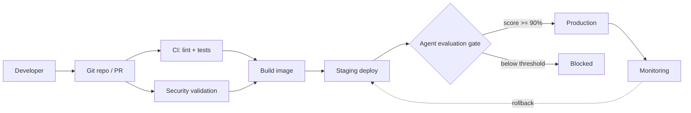

# CI/CD pipeline design

## Stages

| Stage | What runs | Fails the build when |
|---|---|---|
| CI | `ruff`, `pytest` | lint error or failing test |
| Security validation | `pip-audit`, `bandit`, injection tests | CVE, unsafe code, guardrail bypass |
| Build | `docker build` + container smoke test | image won't build or serve |
| Staging | deploy the tagged image | deploy fails |
| **Agent evaluation** | `evals/run_eval.py` | routing accuracy / groundedness < 90% |
| Production | deploy, gated on manual approval | — |
| Monitoring | health, version, error rate | breach triggers rollback |

## Why an agent evaluation gate

Tests catch broken code; they don't catch an agent that routes correctly but
answers badly. `evals/dataset.json` holds golden cases scored on two things:

- **routing accuracy** — did the supervisor pick the right agent?
- **groundedness** — does the reply contain the facts the tools actually returned?

A prompt edit that degrades either one fails the gate and never reaches
production, even though every unit test still passes.

## Deployable artifacts

Each is versioned and validated independently:

| Artifact | Where | Validated by |
|---|---|---|
| Front end | `static/` | container smoke test |
| Backend | `app/main.py` | integration tests |
| Agents + workflows | `app/agents.py` | unit tests + eval gate |
| Prompts & agent config | `app/prompts.py` (`VERSION`) | eval gate |
| LLM config | `CONCIERGE_MODEL` env var | `/version` endpoint |
| External tools/APIs | `app/tools.py` | unit tests |
| Container image | `Dockerfile` | build + scan + smoke test |

Databases, vector stores and cloud infrastructure are out of scope for this
implementation — they would attach at the same points: schema/index migrations
run before the staging deploy, infrastructure applies before the image rolls.
